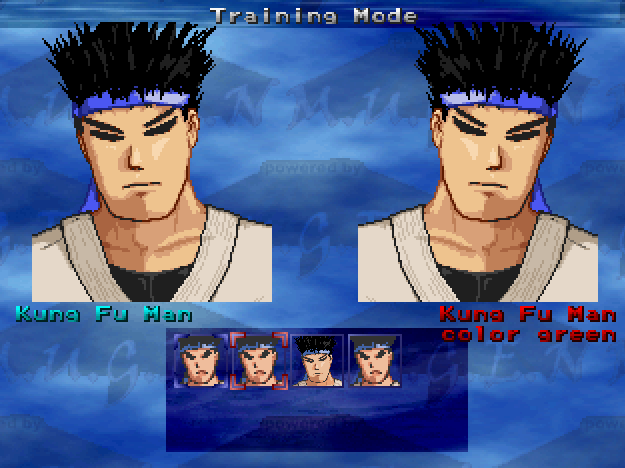

## Forced Palette

Orignally written by Rakiel and edited by me.
Forced palette allows for characters to be forced into a palette on selection.
adding palnum = 4 to a character in the select.def file will force that character to pick palette 4.
also adding 
example:
### This KFM will be selected like normal, a b c x y z palettes. 
kfm, stages/kfm.def
### This KFM will select palette 7 no matter which button you press.
kfm, palnum=7, stages/kfm.def
### This KFM will select palette 1 because 12 - 13 = 1
kfm, palnum=13, stages/kfm.def

You can also add palname to add a name for the palette the character uses.
example:
### This KFM doesnt use palname so it doesnt show in game
kfm, palnum=1, stages/kfm.def
### This KFM uses a green palette so using palname you can display that its a green color
kfm, palnum=7, palname=green, stages/kfm.def

